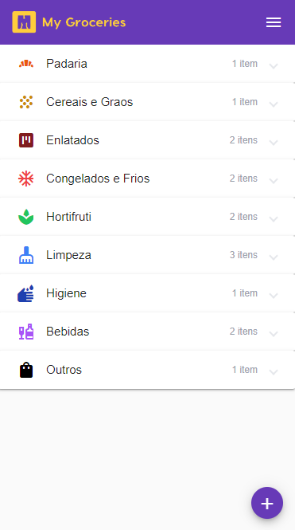

# My Groceries Web App

The purpose of this project is to better understand and practice the Angular Framework and it's functionalities.

It works as a mobile app, viewed in the browser.

The user can add or remove grocery lists and alternate between them.

Each list is then divided into grocery categories, into which the user can add, remove or update any number of grocery items.

## Preview

## Technologies Used

Typescript  
Angular 14  
NgRx (Component Store)  
TailwindCSS

## How to run

First, you need a backend running on port 8080. I made one in Java with Spring Boot for this project, but you can create one in any technology you like. 
The Java backend is in my github too.

I include a example-data.json file in which you can check the exact format the app expects.

Run 'npm i' to install dependencies. 

Finally, serve the app with 'ng serve'.

